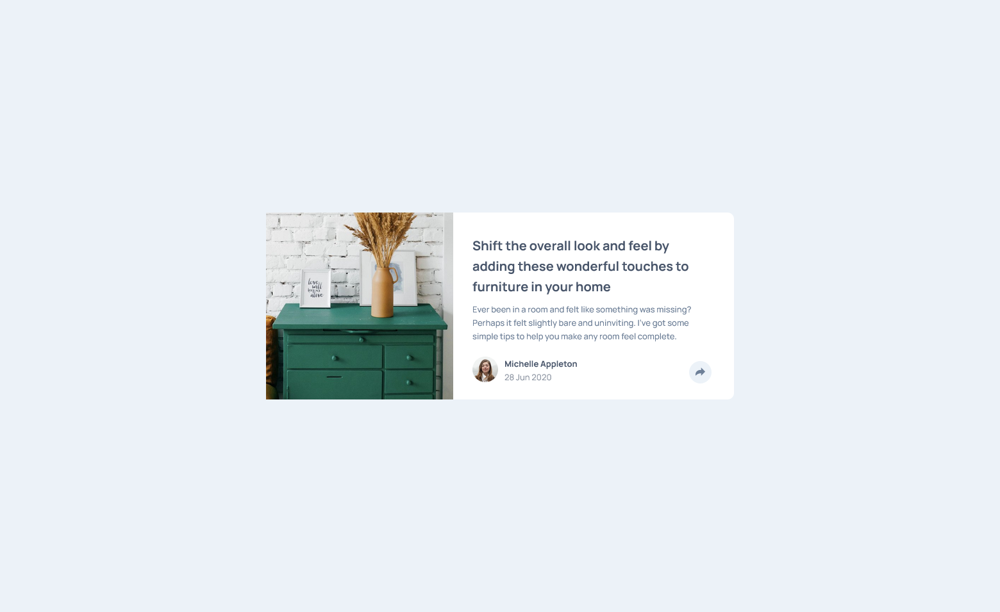

# Frontend Mentor - Article preview component solution

This is a solution to the [Article preview component challenge on Frontend Mentor](https://www.frontendmentor.io/challenges/article-preview-component-dYBN_pYFT).  

## Table of contents

- [Overview](#overview)
  - [The challenge](#the-challenge)
  - [Screenshot](#screenshot)
  - [Links](#links)
- [My process](#my-process)
  - [Built with](#built-with)
  - [Useful resources](#useful-resources)
- [Author](#author)

## Overview

### The challenge

Users should be able to:

- View the optimal layout for the component depending on their device's screen size
- See the social media share links when they click the share icon

### Screenshot




### Links

- Solution URL: [Click](https://www.frontendmentor.io/solutions/responsive-article-preview-component-TCsYPuRJhI)
- Live Site URL: [Click](https://jwalczak94.github.io/Article-preview-component/)

## My process

### Built with

- Semantic HTML5 markup
- CSS custom properties
- Flexbox
- CSS Grid
- Mobile-first workflow

### Useful resources

- [w3schools](https://www.w3schools.com/howto/howto_js_toggle_class.asp) - This helped me with toggle between adding and removing classes from a socials media element with Javascript:
```js
function openToggle() {
    var element = document.getElementById("open-toggle");
    element.classList.toggle("open");
}
```

## Author

- Website - [J.Walczak](https://github.com/jwalczak94)
- Frontend Mentor - [@jwalczak94](https://www.frontendmentor.io/profile/jwalczak94)

